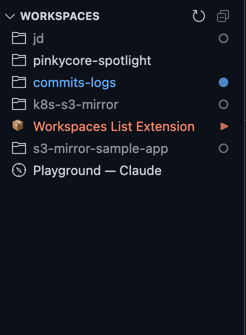

# Workspaces List

[](https://marketplace.visualstudio.com/items?itemName=jdboivin.workspaces-list)
[](https://open-vsx.org/extension/jdboivin/workspaces-list)

> ⚠️ **macOS Only**: This extension currently only works on macOS as it uses native macOS window detection via AppleScript.

A VSCode/Cursor extension that lists all currently opened workspaces in a sidebar with Claude Code session status monitoring.

**Install from:** [VS Code Marketplace](https://marketplace.visualstudio.com/items?itemName=jdboivin.workspaces-list) | [Open VSX Registry](https://open-vsx.org/extension/jdboivin/workspaces-list)

<p align="center">
  
</p>

## Why Use This Extension

When working with multiple Cursor instances, it's easy to lose track of which workspace Claude is working on. This extension provides a single view of all open workspaces and shows real-time status of Claude Code sessions, making it easy to:

- See which workspaces have Claude running, executing tasks, or waiting for input
- Quickly switch between workspaces with a single click
- Monitor multiple AI-assisted projects simultaneously

## Features

### Workspace List

Displays all open VSCode/Cursor windows in the sidebar. Click any workspace to switch focus to that window.

### Claude Code Status Monitoring

Automatically monitors Claude Code activity in all workspaces and displays status badges:

- 🔴 **<span style="color:#FF8A6B">WaitingForInput</span>**: Claude needs your approval or input (orange/red)
- 🟠 **<span style="color:#FF8A6B">Executing</span>**: Claude is actively working on tasks (orange)
- 🟢 **<span style="color:#89D185">RecentlyFinished</span>**: Claude completed a task (green gradient fading over 30 minutes)
- 🔵 **Running**: Claude process is running but idle
- ⚫ **NotRunning**: No active Claude process
- ⚪ **NoSession**: No Claude conversation found

Status updates occur at configurable intervals only when the extension window is focused.

### Browser Window Listing

Also displays open Safari and Chrome windows for quick access.

### Workspace Customization (Optional)

Add a `.workspaces-list.json` file in your workspace root to customize appearance:

```json
{
  "displayName": "My Project",
  "icon": "folder",
  "color": "#4ECDC4"
}
```

**Icon formats:**
- Codicons: `"folder"`, `"file"`, `"git-branch"`
- Emojis: `"🚀"`, `"📦"`
- SVG: `"<svg>...</svg>"`
- File paths: `"./icon.png"` or absolute paths
- URLs: `"https://example.com/icon.png"`

## Requirements

- macOS (uses native window detection)
- VSCode 1.85.0+ or Cursor

## Installation

### From VS Code Marketplace

1. Open VS Code or Cursor
2. Go to Extensions (Ctrl+Shift+X)
3. Search for "Workspaces List"
4. Click Install

### Manual Installation

1. Download the latest `.vsix` file from [Releases](https://github.com/starburst997/workspaces-list/releases)
2. Open VS Code or Cursor
3. Run `Extensions: Install from VSIX...` from the Command Palette (Ctrl+Shift+P)
4. Select the downloaded `.vsix` file

### From Source

```bash
git clone https://github.com/starburst997/workspaces-list.git
cd workspaces-list
npm install
npm run compile
```

Press F5 in VSCode to run the extension.

## Usage

1. Open the "Workspaces" panel in the sidebar
2. View all open workspaces with their Claude status
3. Click a workspace to switch to it
4. Use the refresh button if needed

## Settings

All settings are optional. The extension works with defaults out of the box.

### `workspacesList.statusMonitorInterval`

- **Type:** number (milliseconds)
- **Default:** 5000
- **Description:** Interval for monitoring Claude Code status. Lower values provide faster updates but use more resources.

### `workspacesList.processMonitorInterval`

- **Type:** number (milliseconds)
- **Default:** 30000
- **Description:** Interval for scanning Claude Code processes. This detects when Claude starts or stops running.

### `workspacesList.executingThreshold`

- **Type:** number (milliseconds)
- **Default:** 30000
- **Description:** Time threshold for detecting executing status. File activity within this threshold indicates Claude is actively working.

### `workspacesList.waitingMessageAge`

- **Type:** number (milliseconds)
- **Default:** 10000
- **Description:** Minimum age for assistant messages to be considered as waiting for input. This prevents false positives during rapid execution.

## How It Works

The extension reads Cursor's workspace storage to discover open windows and monitors Claude Code's conversation cache (`~/.claude/projects/`) for activity. Status is determined by analyzing message timestamps and content.

## Known Limitations

- macOS only (uses system-specific window detection)
- Claude status detection is heuristic-based and may not be 100% accurate

## License

MIT
